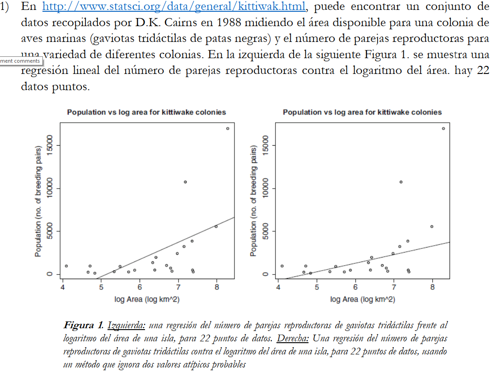
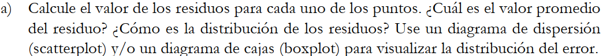
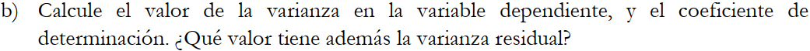
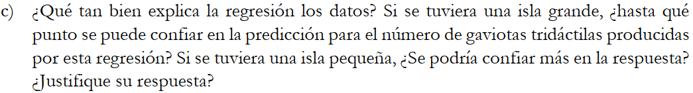
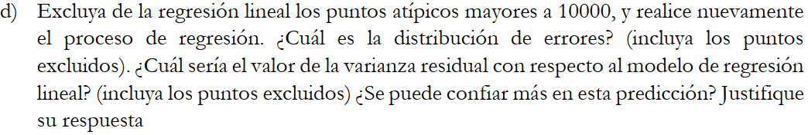
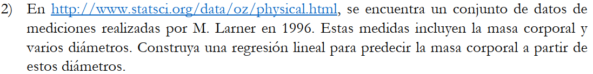
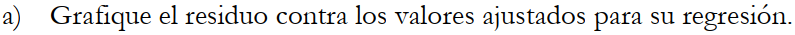
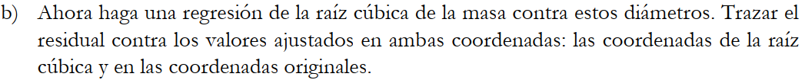
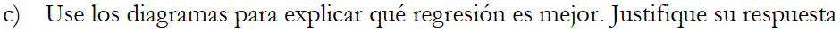

**Daniel Alejandro Leon Ortiz - 2190064**

**Yesid Romario Gualdrón Hurtado - 2190052**

**Daniel Adrián González Buendía - 2191943**
```{r}
K=read.table(file='kittiwak.txt',header=TRUE)
P=read.table(file='physical.txt',header=TRUE)

rls <- function(x,y){
  graphics.off()
  mx=mean(x)
  my=mean(y)
  b1=sum((x-mx)*(y-my))/sum((x-mx)^2)
  b0=my-b1*mx
  if (b1<0){
    plot(x,y, xlim=c(min(0,x),max(x)),ylim=c(min(y),ceiling(max(y,b0))))
    mtext(paste0('y=',round(b0,6),round(b1,6),'x'), side = 3)}
  else{
    plot(x,y, xlim=c(min(0,x),max(x)),ylim=c(min(floor(b0),y),ceiling(max(y))))
    mtext(paste0('y=',round(b0,6),'+',round(b1,6),'x'), side = 3)}
  curve(b0+b1*x,add=TRUE,col='red')
  return(c(b0,b1))} #y=b0+b1x

rls_est <- function(x,y,x0){
  b0=rls(x,y)[1]
  b1=rls(x,y)[2]
  graphics.off()
  y_est=b0+b1*x0
  plot(x,y)
  points(x0,y_est,col='red')
  abline(h=y_est,v=x0,col='blue')
  curve(b0+b1*x,add=TRUE,col='red')
  return(y_est)
}

rls_var <- function(x,y){
  b0=rls(x,y)[1]
  b1=rls(x,y)[2]
  graphics.off()
  n=length(x)
  e2=sum((y-(b1*x+b0))^2)
  return(c(e2/n,e2/(n-2))) 
} #Sesgado (est. de max. veros.) e insesgado (var. res.)

rls_ci <- function(x,y,ci){
  n=length(x)
  S2X = var(x)
  S2R = rls_var(x,y)[2] #Usando la varianza residual insesgada
  if (n>=30)
    q=qnorm((1-ci)/2,lower.tail = 0)
  else
    q=qt((1-ci)/2,df=n-2,lower.tail = 0)
  b0_est=rls(x,y)[1]
  b1_est=rls(x,y)[2]
  graphics.off()
  l_b1=b1_est-q*sqrt(S2R/((n-1)*S2X))
  u_b1=b1_est+q*sqrt(S2R/((n-1)*S2X))
  
  mx=mean(x)
  l_b0=b0_est-q*sqrt(S2R*(1/n+mx^2/((n-1)*S2R)))
  u_b0=b0_est+q*sqrt(S2R*(1/n+mx^2/((n-1)*S2R)))
  return(list('b0'=c(l_b0,u_b0),'b1'=c(l_b1,u_b1)))
}

rls_err <- function(x,y){
  b0=rls(x,y)[1]
  b1=rls(x,y)[2]
  graphics.off()
  e=y-(b1*x+b0)
  return(e)
}

rls_cd <- function(x,y){
  b0=rls(x,y)[1]
  b1=rls(x,y)[2]
  graphics.off()
  y_est=b1*x+b0
  SCE=sum((y-y_est)^2)
  STCC=sum((y-mean(y))^2)
  R2=1-SCE/STCC
  return(R2)
}


```

```{r}
x_K=log(K$Area)
y_K=K$Population
rls(x_K,y_K)
```

```{r}
e_K=rls_err(x_K,y_K)
sprintf("Valor promedio del residuo: %s", mean(abs(e_K)))
plot(x_K,e_K,col='red')  #Scatterplot de la distribución del error
abline(h=0,col='green')
segments(x_K,0,x_K,e_K)  
```
```{r}
boxplot(rls_err(x_K,y_K)) #Boxplot de la distribución del error
```

```{r}
sprintf("Varianza de la variable independiente: %s", var(x_K))
sprintf("Coeficiente de determinación: %s", rls_cd(x_K,y_K))
sprintf("Varianza residual: %s", rls_var(x_K,y_K)[2])
graphics.off()
```

```{r}
#
```

```{r}
x_k=log(K$Area[K$Population<=10000])
y_k=K$Population[K$Population<=10000]
mx=mean(x_k)
my=mean(y_k)
b1=sum((x_k-mx)*(y_k-my))/sum((x_k-mx)^2)
b0=my-b1*mx
plot(x_K,y_K, xlim=c(min(0,x_K),max(x_K)),ylim=c(min(floor(b0),y_K),ceiling(max(y_K))))
mtext(paste0('y=',round(b0,6),'+',round(b1,6),'x'), side = 3)
curve(b0+b1*x,add=TRUE,col='red')
```
```{r}
sprintf("Coeficiente de determinación: %s", rls_cd(x_k,y_k))
n=length(x_K)
e2=sum((y_K-(b1*x_K+b0))^2)
sprintf("Varianza residual: %s", e2/(n-2))
b0=rls(x_k,y_k)[1]
b1=rls(x_k,y_k)[2]
e_k=y_K-(b1*x_K+b0)
sprintf("Valor promedio del residuo: %s", mean(abs(e_k)))
graphics.off()
plot(x_K,e_k,col='red')  #Scatterplot de la distribución del error
abline(h=0,col='green')
segments(x_K,0,x_K,e_k)  
```


```{r}
y_2 = P$Mass
info_2 = lm(y_2~P$Fore+P$Bicep+P$Chest+P$Neck+P$Shoulder+P$Waist+P$Height+P$Calf+P$Thigh+P$Head)
print(info_2$coefficients)
```

```{r}
plot(y_2,info_2$residuals,col='red')  #Scatterplot de la distribución del error
abline(h=0,col='green')
segments(y_2,0,y_2,info_2$residual) 
```

```{r}
y_2_2 = (P$Mass)^(1/3)
info_2_2 = lm(y_2_2~P$Fore+P$Bicep+P$Chest+P$Neck+P$Shoulder+P$Waist+P$Height+P$Calf+P$Thigh+P$Head)
plot(y_2_2,info_2_2$residuals,col='red')  #Scatterplot de la distribución del error
abline(h=0,col='green')
segments(y_2_2,0,y_2_2,info_2_2$residual)
```

```{r}
plot(y_2,info_2_2$residuals,col='red')  #Scatterplot de la distribución del error
abline(h=0,col='green')
segments(y_2,0,y_2,info_2_2$residual)
```


Aqui va parla jaja xd