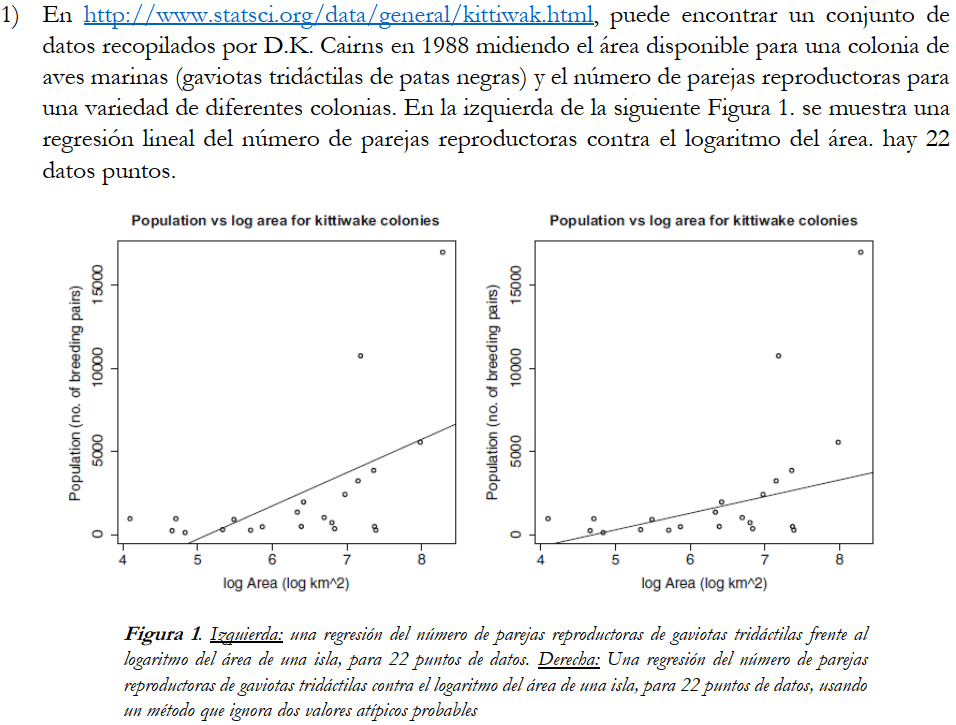

```{r}
K=read.table(file='kittiwak.txt',header=TRUE)
P=read.table(file='physical.txt',header=TRUE)

rls <- function(x,y){
  graphics.off()
  mx=mean(x)
  my=mean(y)
  b1=sum((x-mx)*(y-my))/sum((x-mx)^2)
  b0=my-b1*mx
  if (b1<0){
    plot(x,y, xlim=c(min(0,x),max(x)),ylim=c(min(y),ceiling(max(y,b0))))
    mtext(paste0('y=',round(b0,6),round(b1,6),'x'), side = 3)}
  else{
    plot(x,y, xlim=c(min(0,x),max(x)),ylim=c(min(floor(b0),y),ceiling(max(y))))
    mtext(paste0('y=',round(b0,6),'+',round(b1,6),'x'), side = 3)}
  curve(b0+b1*x,add=TRUE,col='red')
  return(c(b0,b1))} #y=b0+b1x

rls_est <- function(x,y,x0){
  b0=rls(x,y)[1]
  b1=rls(x,y)[2]
  graphics.off()
  y_est=b0+b1*x0
  plot(x,y)
  points(x0,y_est,col='red')
  abline(h=y_est,v=x0,col='blue')
  curve(b0+b1*x,add=TRUE,col='red')
  return(y_est)
}

rls_var <- function(x,y){
  b0=rls(x,y)[1]
  b1=rls(x,y)[2]
  graphics.off()
  n=length(x)
  e2=sum((y-(b1*x+b0))^2)
  return(c(e2/n,e2/(n-2))) 
} #Sesgado (est. de max. veros.) e insesgado (var. res.)

rls_ci <- function(x,y,ci){
  n=length(x)
  S2X = var(x)
  S2R = rls_var(x,y)[2] #Usando la varianza residual insesgada
  if (n>=30)
    q=qnorm((1-ci)/2,lower.tail = 0)
  else
    q=qt((1-ci)/2,df=n-2,lower.tail = 0)
  b0_est=rls(x,y)[1]
  b1_est=rls(x,y)[2]
  graphics.off()
  l_b1=b1_est-q*sqrt(S2R/((n-1)*S2X))
  u_b1=b1_est+q*sqrt(S2R/((n-1)*S2X))
  
  mx=mean(x)
  l_b0=b0_est-q*sqrt(S2R*(1/n+mx^2/((n-1)*S2R)))
  u_b0=b0_est+q*sqrt(S2R*(1/n+mx^2/((n-1)*S2R)))
  return(list('b0'=c(l_b0,u_b0),'b1'=c(l_b1,u_b1)))
}

rls_err <- function(x,y){
  b0=rls(x,y)[1]
  b1=rls(x,y)[2]
  graphics.off()
  e=y-(b1*x+b0)
  return(e)
}
```

```{r}
x_k=log(K$Area)
y_k=K$Population
rls(x_k,y_k)
```

```{r}
e=rls_err(x_k,y_k)
mean(e) #Valor promedio del residuo
plot(x_k,e,col='red')  #Scatterplot de la distribución del error
abline(h=0,col='green')
segments(x_k,0,x_k,e)  
```
```{r}
boxplot(rls_err(x_k,y_k)) #Boxplot de la distribución del error
```

```{r}

```

```{r}

```

```{r}

```

```{r}

```

```{r}

```

```{r}

```

```{r}

```